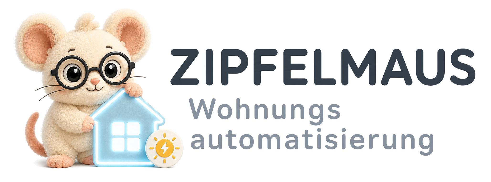

# ZiWoAS – Zipfelmaus Wohnungs Automatisierungs System

Ein Projekt von [zipfelmaus.com](https://zipfelmaus.com).

ZiWoAS ist ein selbst gehostetes Energiemonitoring für die Wohnung. Es sammelt Verbrauchs- und Erzeugungsdaten von Shelly-Steckdosen (via MQTT) und Fritz!Box DECT-Steckdosen und zeigt sie übersichtlich im Browser an.

## Features

- Echtzeit-Dashboard mit Leistung aller Verbraucher und Erzeuger
- Tages- und Monatsberichte mit Energiekosten
- Unterstützung für Shelly-Plugs (MQTT) und Fritz!Box DECT
- Konfigurierbarer Strompreis und Zeitzonen

## Voraussetzungen

- Ruby 4.0.x
- Bundler
- Ein laufender MQTT-Broker (z. B. Mosquitto) und/oder eine Fritz!Box

## Konfiguration

Konfigurationsdatei anlegen:

```bash
cp config/ziwoas.example.yml config/ziwoas.yml
```

Dann `config/ziwoas.yml` anpassen – insbesondere MQTT-Host, Fritz!Box-Zugangsdaten, Strompreis und die Liste der Steckdosen.

## Installation & Start (Entwicklung)

```bash
bundle install
bin/rails db:prepare
bin/dev
```

`bin/dev` startet den Rails-Server und den Daten-Collector parallel.

## Docker

```bash
cp config/ziwoas.example.yml config/ziwoas.yml
# ziwoas.yml anpassen
docker compose up -d
```

Die App ist dann unter `http://localhost:3000` erreichbar. Daten werden in `./storage` gespeichert.

## Tests

```bash
bin/rails test
```